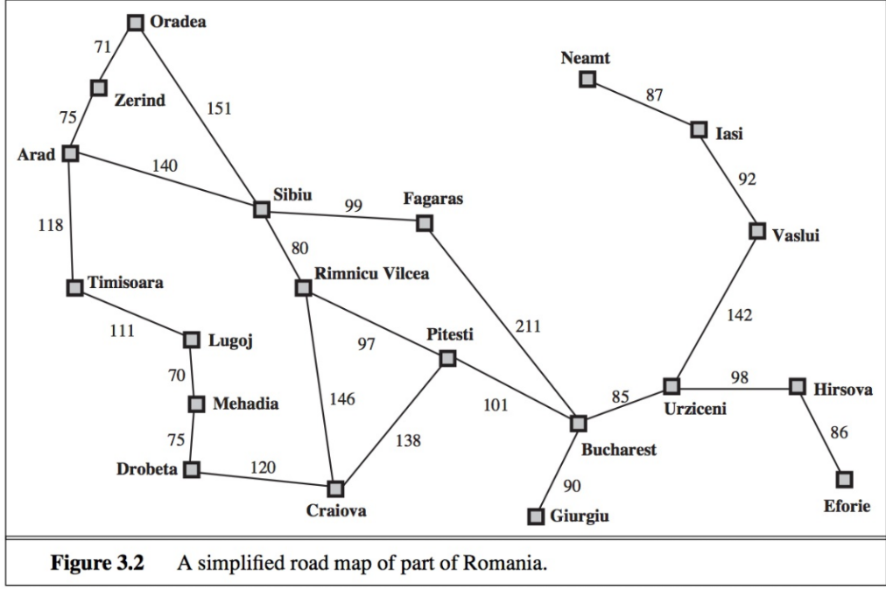

# The Romania Problem

Use search algorithms commonly found in Artificial Intelligence to determine the shortest path between a city that is picked by the user.

## Contents
* [Map of Romania](#map-of-romania)
* [About](#about)
* [Algorithms](#algorithms)
* [Setup](#setup)
* [Quick Run](##quick-run)
* [Authors](#authors)
* [Other](#other)

## Map of Romania

The map that was given for the assignment

## About
Map data has been read into the main program from a text file which consists of the relations between the cities and their respective cost per relation. For this assignment we were to say that all edges costs are the same; 1. As this data is read it is stored in a dictionary, that behaves like an adjacency list; therefore, each key is a parent node and the keys are its children allowing for searches and traversals to be done efficiently.  

### Algorithms
List of the algorithms used in this program
* Breadth-First Search (BFS)
* Depth-First Search (DFS)
* Iterative-Deepening Search (IDS)

### Setup

Use the Command to run normally:

$ python3 main.py

Only set up necessary is if you want the program to spit out all of the possible results by running a script that feeds it all of the possible input.

#### Quick Run

make the 'Run.sh' executable by:

* $ chmod +x Run.sh

then run it:

* $ ./Run.sh

##### Other

I used this assignment to become more familiar with search algorithms that are commonly used in AI programs/machines and as a refresher of packaging and creating modules in python. Please feel free to offer any suggestion in making program work more efficiently.

Thanks

## Authors
### Jake Derkowski [LinkedIn](https://www.linkedin.com/in/jake-derkowski2020/)  [Email](mailto:jakederkowski12@gmail.com)
